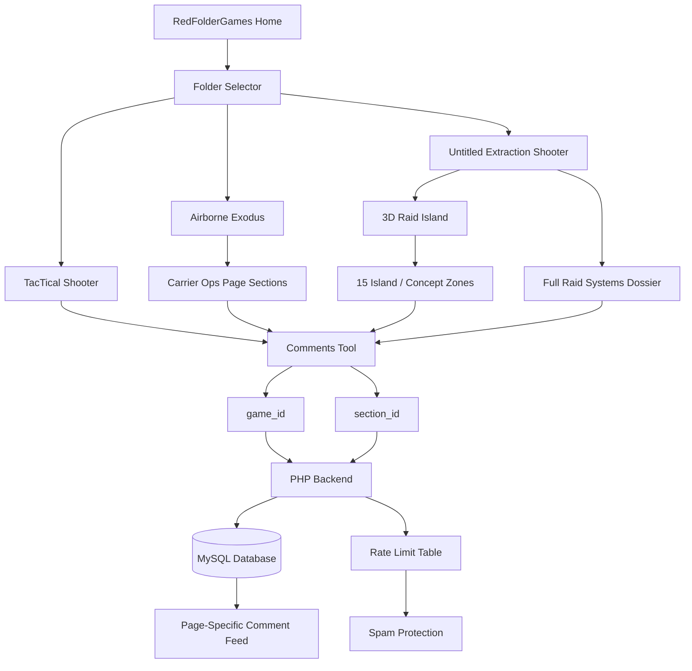

RedFolderGames
# Update Log (AE + Untitled Release)

---

## Added

### Airborne Exodus Page
- Added the full **Airborne Exodus** game concept page.
- Built a custom carrier-ops themed layout around:
  - carrier briefing
  - fuel and runway pressure
  - aircraft progression
  - refueling systems
  - route planning
  - infected pressure
  - co-op logistics
  - endgame escape fantasy
- Added custom page styling so Airborne Exodus has its own identity instead of using the same layout as TacTical Shooter.
- Added dedicated page sections with stable IDs so comments can target real content areas.

### Untitled Extraction Shooter Page
- Added the new **Untitled Extraction Shooter** concept page.
- Reworked the page from a normal centered text idea into a map-first experience.
- Added a full-screen raid island interface focused on:
  - extraction
  - weather
  - body recovery
  - loot extraction
  - reinforcements
  - NPC / PvE pressure
  - gadgets
  - raid loop
  - movement
  - proximity chat
  - weapons
  - survival
  - active lobbies
  - map state
  - design pillars
- Added bottom dossier sections for the deeper markdown concepts that do not fit inside the island tablets.

### 3D Raid Island
- Added a new Three.js island scene for Untitled Extraction Shooter.
- The island now acts as the main way to read the concept.
- Added visible 3D zones:
  - storm/weather area
  - dock, boat, helipad, and vehicle extraction points
  - body recovery ping
  - loot compound and crates
  - radio/uplink reinforcement station
  - tactical NPC patrol tokens
  - gadget/cache area
- Added drag rotation for inspecting the island.
- Added rotate-left and rotate-right controls.
- Added clickable 3D markers that update the active info tablet.
- Added a low-detail toggle for weaker devices.
- Added WebGL fallback text if the browser cannot start the 3D scene.

### Comments On Game Pages
- Added the comments tool to:
  - TacTical Shooter
  - Airborne Exodus
  - Untitled Extraction Shooter
- Added page-specific comment targets for AE and Untitled.
- Added support for comments on map zones that are not normal page sections.
- Added readable page labels in the comment feed, such as:
  - `Airborne Exodus / Core Gameplay Loop`
  - `Untitled Extraction / Weather`
  - `TacTical Shooter / General`

### Backend Comment Game IDs
- Added frontend support for `game_id` on comments.
- Comments can now be loaded per game:
  - `tts`
  - `ae`
  - `untitled`
- Added backend support for:
  - `GET /api/commentstts?game_id=tts`
  - `GET /api/commentstts?game_id=ae`
  - `GET /api/commentstts?game_id=untitled`
- New comments now store both:
  - `game_id`
  - `section_id`
- Old TTS comments can still be supported through the old/default behavior.

### Comment Rate Limit
- Added a simple backend rate limit to reduce comment spam.
- Limit is currently:
  - 5 comments
  - per IP
  - per 10 minutes
- Added a new `comment_rate_limits` table for tracking comment attempts.
- Added a clear frontend alert when the backend returns a rate-limit message.

---

## Changes

### Airborne Exodus Layout
- Replaced the early simple page structure with a larger custom experience.
- Added header and footer integration while keeping the page themed to carrier survival.
- Improved spacing around the AE header and alert strip.
- Added section anchors for the comment system.
- Kept the page separate from the homepage styling so the main page terminal look is not affected.

### Untitled Extraction Layout
- Moved Untitled Extraction page text into a dedicated content part:
  - `UntitledExtractionContent.jsx`
- Kept page data in one place:
  - island zones
  - dossier sections
  - comment sections
- Expanded the active-zone info tablets so they use more available space.
- Reworked the lower dossier into clearer mechanic explanations based on `untitled.md`.
- Moved extra markdown concepts into scrollable page content below the island.

### Header / Footer
- Added header and footer usage to the new game pages.
- Adjusted the header hover behavior so `RedFolderGames` can switch to `HOME` without the hover target collapsing.
- Expanded the home hitbox so the hover conversion works across the full title area.
- Adjusted header spacing for the Airborne Exodus page.

### Folders / Routing
- Added routes for:
  - `/RedFolderGames/AirborneExodus`
  - `/RedFolderGames/UntitledExtraction`
- Reconnected Untitled Extraction Shooter to the folder list.
- Updated folder entries so the new games can be reached from the homepage folders system.

### Services / API
- Updated comment service to support `getByGame(gameId)`.
- Switched dev API calls to use the Vite `/api` proxy.
- Kept production API calls pointed at the live PHP backend.
- Set comment and feedback requests to avoid credential-based CORS issues.

### Scrollbar Styling
- Moved custom scrollbar styling into `multiuse.css`.
- Made scrollbars less plain and more consistent across comment windows and page panels.

---

## Improvements

### Untitled Extraction Island
- Improved the island from a blocky prototype into a cleaner low-poly raid diorama.
- Reduced oversized billboard labels and moved toward smaller floating labels.
- Improved weather readability with storm clouds, rain/fog, and flooded lowland visuals.
- Improved extraction readability with dock, boat, helipad, and exit markers.
- Improved NPC readability with small tactical tokens, patrol paths, and detection cones.
- Improved loot, radio, body recovery, and gadget zones so each area has a clear purpose.
- Reduced z-fighting on lower island layers.
- Added better scene cleanup and fallback behavior.

### Untitled Extraction Text
- Rewrote vague copy into clearer game mechanic explanations.
- Re-aligned the website text with `untitled.md`.
- Replaced abstract labels with markdown-native concepts:
  - Extra Backpack Run
  - Interrupted Negotiation
  - Reinforcement Or Boat Choice
  - Loot-Only Extraction
  - Body Recovery
  - Enemy Body Extraction
  - Stealing Bodies
  - Extraction Windows
  - Weather Shift
  - Reinforcement Station
  - Proximity Chat Promise
- Improved gadget explanations so they describe what players actually do and what tradeoffs exist.

### Comment System
- `CommentsSection` now accepts optional `sectionOptions`.
- TTS can still scan normal `<section id="...">` elements automatically.
- AE and Untitled can pass their own complete list of comment targets.
- Comment feed can show which page and section a comment belongs to.
- Replies keep the correct game context.
- Legacy section IDs are still recognized where possible.

### Backend Stability
- Restored the feedback endpoint response shape expected by the frontend.
- Re-added the backend exception handler so future PHP errors are easier to see.
- Fixed the live backend DB connection issue caused by the invalid empty port expression.
- Added the correct GitHub Pages origin to the CORS allow list:
  - `https://redking-11.github.io`

---

## Fixes

### API / CORS
- Fixed local development API calls through the Vite proxy.
- Fixed live GitHub Pages CORS origin mismatch.
- Fixed comment requests failing when the backend did not include the expected CORS header.
- Fixed feedback display expecting a raw array while the backend briefly returned a wrapped object.

### Comments
- Fixed AE and Untitled comment dropdowns missing many intended targets.
- Fixed Untitled comment targets so island zones can be commented on even when they are not actual page sections.
- Fixed the React crash caused by comment section state handling.
- Fixed comment feed filtering so game-specific comments do not vanish when the backend response does not echo every field.

### Untitled Extraction
- Fixed WebGL fallback behavior after a browser/context issue.
- Fixed Three.js shadow-map deprecation warning by avoiding the deprecated shadow map constant.
- Reduced bottom-layer visual flicker/z-fighting on the island.
- Fixed oversized title/panel spacing so text no longer pushes over panel borders.
- Improved mobile stacking to reduce overlap between island, controls, tablets, and comments.

### Airborne Exodus
- Fixed header spacing around the top alert/briefing area.
- Fixed comment section coverage so major visible page sections are targetable.
- Fixed page-level integration with shared header/footer.

### Homepage Safety
- Avoided further homepage palette/layout changes after the terminal look was restored.
- Kept new release work scoped to AE, Untitled, comments, services, and backend fixes.

---

## Backend / Database Notes

### Required Database Changes
The comments system now expects these database updates:

```sql
ALTER TABLE commentstts
ADD COLUMN game_id VARCHAR(50) NULL AFTER id;
```

```sql
CREATE TABLE IF NOT EXISTS comment_rate_limits (
    id INT AUTO_INCREMENT PRIMARY KEY,
    ip_address VARCHAR(45) NOT NULL,
    created_at TIMESTAMP DEFAULT CURRENT_TIMESTAMP,
    INDEX idx_comment_rate_limits_ip_created (ip_address, created_at)
);
```

Optional migration for older comments:

```sql
UPDATE commentstts
SET game_id = 'tts'
WHERE game_id IS NULL;
```

### Backend Files Updated
- `controllers/commentsTTSManagement.php`
- `models/commentsTTS.php`
- `controllers/feedbackManagement.php`
- `helpers/helpers.php`
- `index.php`
- `models/connection.php`

---

## Release Checks

- Confirmed production build runs successfully.
- Confirmed Vite chunk-size warning is not a release blocker.
- Checked targeted ESLint during feature work.
- Checked `git diff --check` during feature work.
- Checked PHP syntax for edited backend files.
- Verified backend issue was caused by the broken DB port line and fixed it.

---

## Known / Pending

- Three.js and large markdown/diagram dependencies make the production bundle large.
  - This can be improved later with route-level lazy loading.
- Comment spam protection is basic rate limiting.
  - CAPTCHA or Cloudflare Turnstile can be added later if spam becomes a real issue.
- Untitled Extraction island can still be improved visually over time.
  - Better terrain blending, roads following height, and more detailed props are future polish.
- Backend changes must be uploaded to cPanel whenever PHP is changed locally.

---

## Summary

This release adds two major game concept pages and turns Untitled Extraction Shooter into the most interactive concept page on the site so far.

Airborne Exodus now has a full carrier-survival presentation, while Untitled Extraction now uses a rotatable 3D island to explain the raid systems visually. The comments system was expanded so each game can have its own comment feed and section targets, and the backend now supports `game_id`, CORS for the new GitHub Pages domain, and basic anti-spam rate limiting.

---

# System Overview


